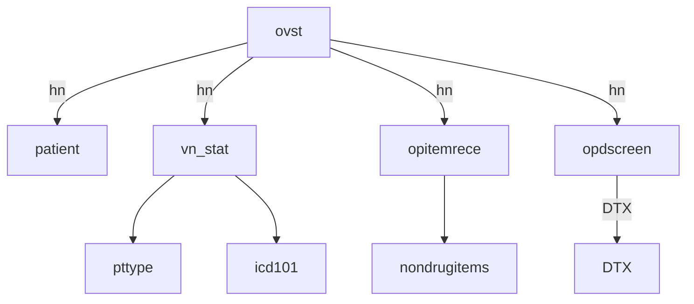

## SQL Scripts

| Script | Purpose |
| :--- | :--- |
| `check_daily_patient.sql` | Daily patient service tracking |
| `check_service_cost.sql` | Patient service cost analysis |
| `dtx_export.sql` | DTX data extraction |
| `masked_patient.sql` | Patient data masking |
| `migration_patient_data.sql` | Patient data transformation and migration |
| `telemedicine_export.sql` | Telemedicine patient data extraction |
| `view_allergy_history.sql` | Drug allergy history |
| `view_village.sql` | Patient geographic information |

## Database Relationships

